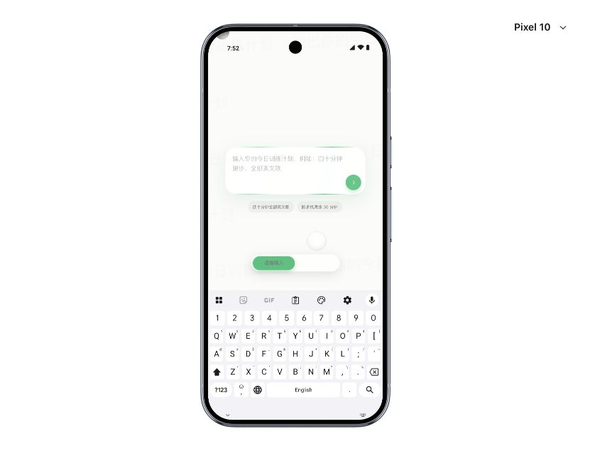
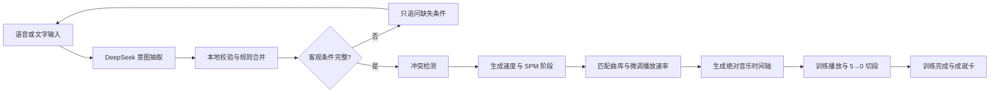

# PaceMix

PaceMix 是一个面向跑步机跑步、快走和爬坡训练的 AI 音乐训练原型。用户用自然语言描述训练目标，系统会补齐必要条件，生成明确的分阶段速度、时长、目标步频（SPM）以及严格对齐阶段边界的音乐时间轴。

> 当前状态：可完整演示的 Web App。支持 iPhone / Pixel 10 设备预览、中文自然语言交互、DeepSeek NLU、本地规则降级、训练播放、阶段倒计时和训练成就页。



## 先理解三个产品规则

1. **SPM 是步频，BPM 是音乐节拍。** 两者不是心率，也不直接等同。系统会在 `1× / 2× / 0.5×` 音乐拍点映射中寻找最接近目标步频的歌曲，并把播放速度限制在 `0.9×–1.1×`。
2. **训练时间是绝对时间轴。** 阶段结束时不等待歌曲播放完；末尾渐弱后立刻进入下一阶段的第一首歌。
3. **阶段切换只做 5→0 倒计时。** 每秒有一个高于当前音乐音量的温和提示音，不提供更早的“准备变速”提示。

## 最快运行方式

### 环境要求

- Node.js 22 LTS（仓库包含 `.nvmrc`）
- npm 10+
- 推荐使用 Chrome、Edge 或 Safari

### 方案 A：无需 API Key，直接体验

这种方式使用确定性本地解析器，主要流程与训练播放都可用。

```bash
git clone https://github.com/uan-iel/pacemix.git
cd pacemix
npm ci
npm run dev -- --host 127.0.0.1 --port 4173 --strictPort
```

浏览器打开：<http://127.0.0.1:4173/>

### 方案 B：启用 DeepSeek 自然语言理解

```bash
git clone https://github.com/uan-iel/pacemix.git
cd pacemix
npm ci
cp .env.example .env.local
```

编辑 `.env.local`，只填写自己的 key：

```dotenv
DEEPSEEK_API_KEY=your_deepseek_api_key
```

随后一条命令同时启动前端和本地 NLU 代理：

```bash
npm run dev:all
```

前端地址为 <http://127.0.0.1:4173/>，NLU 代理默认为 `http://127.0.0.1:8788/api/pace-nlu`。

API key 只由本地 Node 代理读取，不会进入浏览器 bundle。不要创建 `VITE_*_API_KEY`，也不要提交 `.env.local`。

### 添加演示音乐

由于版权原因，仓库不包含歌曲和封面。要体验完整播放效果，请将自己拥有合法授权的音乐文件放入 `public/music/`，并准备同名的封面图片放入 `public/covers/`：

```text
public/music/  
  五月天 - 倔强.mp3
  Taylor Swift - Shake It Off.mp3
  ...
public/covers/
  五月天 - 倔强.jpg
  Taylor Swift - Shake It Off.jpg
  ...
```

之后重新启动前端即可自动识别。没有音乐时，App 的 UI、倒计时和阶段切换仍可正常演示。

## 可用于验收的输入

```text
四十分钟跑步，全部英文歌，前八分钟 6km/h，中间二十四分钟 10km/h，最后八分钟 5.5km/h
```

也可以故意省略信息来观察 AI 补问：

```text
四十分钟全部英文歌
```

系统应该保留“40 分钟”和“全部英文歌”，只追问运动类型与训练强度；用户给出完整分段配速后，不应再次询问强度。

## 产品流程



必须获得的客观条件：

- 总训练时长
- 运动类型：跑步、跑步机爬坡或跑步机快走
- 训练强度：明确配速、轻松/中等/挑战，或明确授权 AI 安排

音乐语言是硬偏好。用户说“全部英文歌”时，不能混入中文歌；用户仅用中文表达，不代表偏好中文歌。

## 架构

```text
Browser / React UI
  ├─ src/Prototype.tsx       页面状态与交互
  ├─ src/prototype.css       V2.2 绿色微粒视觉系统
  ├─ src/lib/pacemix.ts      解析、校验、阶段和歌单时间轴
  └─ src/mobile/             双设备运行时、键盘、底部弹层
             │
             │ POST { text, draft }
             ▼
Local NLU Proxy
  └─ server/deepseek-nlu-proxy.mjs
             │
             ▼
DeepSeek Chat Completions API
```

LLM 负责理解开放式表达，但它的结果不会直接驱动产品状态。所有模型输出都会经过 `normalizeIntentPayload` 校验，并与确定性解析结果合并。这样既能理解自然语言，也能防止错误字段、虚构音乐偏好或异常速度进入训练计划。网络或模型不可用时，产品自动回退到本地解析器。

## 目录说明

| 路径 | 用途 |
| --- | --- |
| `src/Prototype.tsx` | App 页面、状态流转、音频播放与倒计时 |
| `src/prototype.css` | PaceMix 产品 UI |
| `src/lib/pacemix.ts` | 领域模型、自然语言降级解析、冲突检测、SPM/BPM 调度 |
| `src/mobile/` | 手机外框、双平台状态栏、键盘、滚动和 BottomSheet |
| `server/deepseek-nlu-proxy.mjs` | 保护 API key 的本地 DeepSeek 代理 |
| `public/music/` | 演示曲库 |
| `public/covers/` | 演示封面 |
| `tests/` | 运行时与 Sites worker 测试 |
| `AGENTS.md` | AI agent 必读的架构边界、视觉规范和交互约束 |
| `design-qa.md` | 已完成的视觉与功能验收记录 |

## 常用命令

| 命令 | 作用 |
| --- | --- |
| `npm run dev` | 只启动 Vite 前端 |
| `npm run dev:nlu` | 只启动 DeepSeek 本地代理 |
| `npm run dev:all` | 同时启动前端和 NLU 代理 |
| `npm run check:runtime` | 校验 28 个受保护的手机运行时文件 |
| `npm run build` | TypeScript 检查并生成生产构建 |
| `npm run test:sites` | 验证静态资源和 SPA fallback |
| `npm run test:runtime` | 运行 Playwright 运行时测试 |

## 给接手的 AI agent

1. 先完整阅读 [`AGENTS.md`](AGENTS.md)，不要跳过。里面定义了受保护的运行时文件和已经锁定的产品决定。
2. 产品 UI 主要修改范围是 `src/Prototype.tsx` 和 `src/prototype.css`。
3. 不要把 SPM 改成 BPM，不要把 BPM 描述成心率。
4. 不要删除本地解析器。它不是用来替代大模型，而是用于安全校验、明确规则和离线降级。
5. 不要引入 5 秒以前的变速提醒。
6. 修改后至少运行：

```bash
npm run check:runtime
npm run build
npm run test:sites
```

7. 同时在 iPhone 和 Pixel 10 预览中检查键盘、安全区、底部操作区和训练播放页。

## 环境变量

| 变量 | 必填 | 默认值 | 说明 |
| --- | --- | --- | --- |
| `DEEPSEEK_API_KEY` | 启用 LLM 时必填 | 无 | 仅供本地服务端代理使用 |
| `DEEPSEEK_MODEL` | 否 | `deepseek-chat` | DeepSeek 模型名 |
| `PACEMIX_NLU_PORT` | 否 | `8788` | 本地代理端口 |
| `PACEMIX_ALLOWED_ORIGIN` | 否 | `http://127.0.0.1:4173` | 允许访问代理的前端 origin |
| `VITE_PACEMIX_NLU_ENDPOINT` | 启用 LLM 时必填 | 示例已配置 | 浏览器访问的本地代理地址，不含密钥 |

## 数据与隐私

- 训练计划和步频校准存储在浏览器 `localStorage`，目前没有用户账户或云端数据库。
- NLU 代理只向模型发送本次文本和当前结构化草稿。
- `.env.local`、构建产物、测试结果、演示音乐及封面均已加入 `.gitignore`，不会进入仓库。
- 自行放入 `public/music/` 和 `public/covers/` 的歌曲和封面仅用于本地演示。公开发布或商业化前，必须替换为已获得授权的曲库/API 资源。

## 构建与部署

```bash
npm run build
```

前端产物位于 `dist/client/`。构建脚本还会生成 `dist/server/index.js` 和 `dist/.openai/hosting.json`，供当前 Sites/Worker 包装层使用。生产环境中应把 `/api/pace-nlu` 放到受认证、限流并使用密钥管理服务的后端，不要依赖本地代理。

## 故障排查

- **4173 端口被占用**：关闭旧的 Vite 进程，或同时修改前端端口、`PACEMIX_ALLOWED_ORIGIN` 和浏览器访问地址。
- **AI 请求失败但页面仍可生成**：这是本地解析器降级；检查 `DEEPSEEK_API_KEY` 和 8788 端口。
- **CORS 403**：确认访问地址与 `PACEMIX_ALLOWED_ORIGIN` 完全一致，`localhost` 和 `127.0.0.1` 被视为不同 origin。
- **没有音乐**：确认 `public/music/` 未被删除，并通过浏览器手势先开始播放，避免自动播放策略拦截音频。
- **运行时校验失败**：阅读报错并恢复受保护文件，不要绕过或削弱校验脚本。

## 当前验证结果

- `npm run check:runtime`：通过
- `npm run build`：通过
- `npm run test:sites`：4/4 通过
- iPhone / Pixel 10：完成核心流程和视觉检查

更完整的验收记录见 [`design-qa.md`](design-qa.md)。
